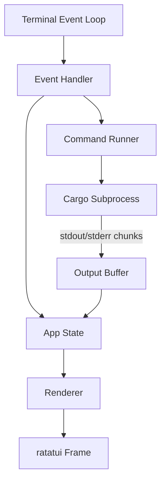

# cargo-tui Design Document

## Overview

cargo-tui is a terminal user interface (TUI) application written in Rust that wraps the Cargo package manager. It provides full access to Cargo's functionality through a keyboard-driven, navigable menu system, eliminating the need to memorize commands and flags.

The application is built on [ratatui](https://github.com/ratatui-org/ratatui) for rendering and uses Rust's `std::process` (via `tokio::process` for async streaming) to spawn and stream Cargo subprocesses. The design follows a single-threaded event loop with async I/O for subprocess output.

### Key Design Goals

- Full Cargo feature coverage through discoverable menus
- Real-time streaming output with auto-scroll
- Clean terminal restoration on exit (including panics)
- Keyboard-only operation with contextual help

---

## Architecture

The application follows a Model-View-Update (MVU) pattern, similar to Elm, adapted for ratatui's immediate-mode rendering.



### Component Overview

```
src/
├── main.rs           # Entry point, terminal setup/teardown
├── app.rs            # App state, top-level event dispatch
├── ui/
│   ├── mod.rs        # Root render function
│   ├── menu.rs       # Command_Menu widget
│   ├── output.rs     # Output_Panel widget
│   ├── status_bar.rs # Status_Bar widget
│   ├── input.rs      # Input field / form widget
│   └── help.rs       # Help overlay widget
├── cargo/
│   ├── mod.rs        # Cargo command definitions and categories
│   ├── runner.rs     # Subprocess spawning and output streaming
│   ├── workspace.rs  # Cargo.toml detection and manifest parsing
│   └── metadata.rs   # cargo metadata JSON parsing
└── event.rs          # Terminal + subprocess event multiplexing
```

### Event Loop

The main loop multiplexes two event sources using `tokio::select!`:

1. Terminal key/resize events (via `crossterm`)
2. Subprocess stdout/stderr chunks (via `tokio::process`)

Each iteration produces an `Event` that is dispatched to the `App::handle_event` method, which mutates `AppState` and optionally spawns a new command. The renderer then draws the updated state to the terminal.

---

## Components and Interfaces

### App State (`app.rs`)

Central state machine. Holds all mutable state and drives transitions.

```rust
pub struct App {
    pub workspace: Option<Workspace>,
    pub menu: MenuState,
    pub output: OutputBuffer,
    pub input: Option<InputState>,
    pub runner: Option<RunnerHandle>,
    pub mode: AppMode,
    pub status: StatusBar,
}

pub enum AppMode {
    Menu,
    Input(InputContext),
    Running,
    Help,
    Confirm(ConfirmContext),
    Error(String),
}
```

### Command Menu (`cargo/mod.rs`, `ui/menu.rs`)

Commands are defined as a static tree of `CommandNode` values grouped by category. Navigation state is tracked as a stack of selected indices, enabling back-navigation with `Escape`.

```rust
pub struct CommandNode {
    pub name: &'static str,
    pub description: &'static str,
    pub action: CommandAction,
}

pub enum CommandAction {
    Submenu(Vec<CommandNode>),
    Execute(CargoCommand),
    RequiresInput(InputSpec, Box<CommandAction>),
    Confirm(Box<CommandAction>),
}

pub enum CargoCommand {
    Build { release: bool },
    Check,
    Clean,
    Test { filter: Option<String>, doc: bool },
    Bench,
    Run { bin: Option<String>, args: Option<String> },
    Add { krate: String, version: Option<String> },
    Remove { krate: String },
    Update { krate: Option<String> },
    Publish { dry_run: bool },
    Package,
    Login { token: String },
    Yank { krate: String, version: String },
    Metadata,
    Doc { open: bool },
    Fmt,
    Clippy,
    Fix,
    Tree,
}
```

### Command Runner (`cargo/runner.rs`)

Spawns a `tokio::process::Command` and streams output chunks back to the app via an `mpsc` channel. Returns a `RunnerHandle` that can be used to await completion or send a kill signal.

```rust
pub struct RunnerHandle {
    pub tx_kill: oneshot::Sender<()>,
    pub task: JoinHandle<ExitStatus>,
}

pub async fn spawn_cargo(
    cmd: &CargoCommand,
    workspace_root: &Path,
    output_tx: mpsc::Sender<OutputChunk>,
) -> Result<RunnerHandle>;
```

Output chunks carry a tag indicating stdout vs stderr:

```rust
pub enum OutputChunk {
    Stdout(String),
    Stderr(String),
    Done(ExitStatus),
}
```

### Output Buffer (`ui/output.rs`)

Stores the last 10 command outputs as a ring buffer. Each entry holds a `Vec<StyledLine>` (pre-rendered with ANSI color stripping/mapping). Scroll state is tracked per-entry.

```rust
pub struct OutputBuffer {
    pub history: VecDeque<CommandOutput>,   // max 10
    pub current: usize,                      // index into history
    pub scroll: ScrollState,
    pub auto_scroll: bool,
}

pub struct CommandOutput {
    pub command_label: String,
    pub lines: Vec<StyledLine>,
    pub exit_status: Option<ExitStatus>,
}
```

### Workspace Detection (`cargo/workspace.rs`)

Walks parent directories from `std::env::current_dir()` looking for `Cargo.toml`. Parses the manifest using `toml` crate to extract workspace members and dependency sections.

```rust
pub struct Workspace {
    pub root: PathBuf,
    pub manifest: Manifest,
}

pub struct Manifest {
    pub name: String,
    pub members: Vec<String>,
    pub dependencies: Vec<Dependency>,
    pub dev_dependencies: Vec<Dependency>,
    pub build_dependencies: Vec<Dependency>,
    pub binaries: Vec<BinaryTarget>,
}

pub struct Dependency {
    pub name: String,
    pub version: String,
    pub section: DepSection,
}

pub enum DepSection { Normal, Dev, Build }
```

### Input Field (`ui/input.rs`)

Inline text input widget supporting standard editing keys. Holds cursor position and the current string value.

```rust
pub struct InputState {
    pub value: String,
    pub cursor: usize,
    pub spec: InputSpec,
    pub error: Option<String>,
}

pub struct InputSpec {
    pub prompt: &'static str,
    pub required: bool,
    pub placeholder: &'static str,
}
```

### Status Bar (`ui/status_bar.rs`)

Renders a single line at the bottom showing: workspace path | current mode | context-sensitive key bindings.

---

## Data Models

### Terminal Lifecycle

Terminal setup and teardown are handled in `main.rs` using a guard pattern to ensure cleanup even on panic:

```rust
struct TerminalGuard(Terminal<CrosstermBackend<Stdout>>);

impl Drop for TerminalGuard {
    fn drop(&mut self) {
        let _ = disable_raw_mode();
        let _ = execute!(self.0.backend_mut(), LeaveAlternateScreen);
    }
}
```

### Event Model

```rust
pub enum Event {
    Key(KeyEvent),
    Resize(u16, u16),
    Output(OutputChunk),
    Tick,
}
```

Events are produced by a background task that polls `crossterm::event::poll` and the subprocess output channel, then sends them to the main loop via an `mpsc` channel.

### Menu Navigation State

```rust
pub struct MenuState {
    pub stack: Vec<MenuLevel>,
}

pub struct MenuLevel {
    pub nodes: Vec<CommandNode>,
    pub selected: usize,
}
```

The stack grows when entering a submenu and shrinks on `Escape`. When the stack is empty and `Escape` is pressed, the app exits.

### Key Binding Registry

Key bindings are defined per `AppMode` as a static slice of `(KeyCode, &str)` pairs, consumed by both the event handler and the help overlay / status bar renderer.

```rust
pub struct KeyBinding {
    pub key: &'static str,
    pub description: &'static str,
}
```

---

## Correctness Properties

*A property is a characteristic or behavior that should hold true across all valid executions of a system — essentially, a formal statement about what the system should do. Properties serve as the bridge between human-readable specifications and machine-verifiable correctness guarantees.*

### Property 1: Workspace detection finds Cargo.toml in any ancestor

*For any* directory path that is a descendant of a directory containing `Cargo.toml`, the workspace detection function shall return the path to that `Cargo.toml`.

**Validates: Requirements 1.1, 1.2**

---

### Property 2: Missing workspace produces error

*For any* directory path that has no `Cargo.toml` in itself or any ancestor, the workspace detection function shall return an error (not a workspace).

**Validates: Requirements 1.3**

---

### Property 3: CargoCommand serializes to correct argv

*For any* `CargoCommand` value, converting it to a `Vec<OsString>` argv and then reconstructing the command label shall produce a string that starts with `"cargo"` and contains all expected flags and arguments.

**Validates: Requirements 3.1, 3.2, 3.3, 3.4, 4.1, 4.3, 4.4, 5.1, 6.1, 6.2, 6.4, 7.2, 7.3, 7.4, 8.1, 8.2, 8.3, 8.4, 8.5, 8.6, 8.7**

---

### Property 4: Output buffer retains at most 10 entries

*For any* sequence of command completions, the output buffer history length shall never exceed 10.

**Validates: Requirements 9.5**

---

### Property 5: Auto-scroll disables on manual scroll-up

*For any* output buffer state where auto-scroll is enabled, after the user scrolls up by any positive amount, auto-scroll shall be disabled.

**Validates: Requirements 9.3, 9.4**

---

### Property 6: Auto-scroll re-enables on scroll-to-bottom

*For any* output buffer state where auto-scroll is disabled, after the user scrolls to the last line, auto-scroll shall be re-enabled. (Round-trip: disable then re-enable.)

**Validates: Requirements 9.3, 9.4**

---

### Property 7: Empty/whitespace input is rejected for required fields

*For any* `InputState` with `required = true`, submitting a value composed entirely of whitespace characters shall produce a validation error and leave the input active.

**Validates: Requirements 10.5**

---

### Property 8: Input editing operations preserve cursor invariant

*For any* `InputState`, after any sequence of editing key operations (`Backspace`, `Ctrl+A`, `Ctrl+E`, `Ctrl+U`, character insertion), the cursor position shall always satisfy `cursor <= value.len()`.

**Validates: Requirements 10.2**

---

### Property 9: Menu stack back-navigation is a round trip

*For any* menu navigation sequence that enters N submenus and then presses `Escape` N times, the resulting menu stack depth shall equal the initial depth.

**Validates: Requirements 2.5**

---

### Property 10: Concurrent command prevention

*For any* app state where a command is currently running (`runner` is `Some`), attempting to launch a second command shall leave the runner unchanged (still the original handle).

**Validates: Requirements 3.7**

---

### Property 11: Terminal state is restored on exit

*For any* execution path (normal exit, error exit, panic), the `TerminalGuard` drop implementation shall call `disable_raw_mode` and `LeaveAlternateScreen`, ensuring the terminal is restored.

**Validates: Requirements 11.2, 11.4**

---

### Property 12: Dependency list reflects manifest sections

*For any* `Cargo.toml` content, parsing it and grouping dependencies by section shall produce three groups (`[dependencies]`, `[dev-dependencies]`, `[build-dependencies]`) whose union equals the complete set of declared dependencies.

**Validates: Requirements 6.7**

---

## Error Handling

### Subprocess Errors

- Non-zero exit codes are surfaced in the `OutputBuffer` as a styled status line showing the exit code and a failure indicator.
- If the subprocess fails to spawn (e.g., `cargo` not found on `PATH`), the app transitions to `AppMode::Error` with a descriptive message.

### Workspace Errors

- If no `Cargo.toml` is found, the app prints an error to stderr and exits with code 1 before entering the TUI event loop.
- Manifest parse errors are shown as a non-fatal warning in the status bar; the app continues with reduced functionality (dependency list unavailable).

### Terminal Errors

- The `TerminalGuard` pattern ensures `disable_raw_mode` and `LeaveAlternateScreen` are called in all exit paths, including panics.
- Resize events trigger an immediate re-render; ratatui handles layout recalculation automatically.

### Input Validation Errors

- Required fields that receive empty/whitespace input display an inline error message below the input widget.
- The input field remains active and focused until valid input is submitted or `Escape` is pressed.

---

## Testing Strategy

### Dual Testing Approach

Both unit tests and property-based tests are required. They are complementary:

- Unit tests cover specific examples, integration points, and error conditions.
- Property-based tests verify universal invariants across randomly generated inputs.

### Property-Based Testing

The property-based testing library is [**proptest**](https://github.com/proptest-rs/proptest) (crate: `proptest`).

Each property test must run a minimum of **100 iterations** (proptest default is 256, which satisfies this).

Each property test must be tagged with a comment in the following format:

```
// Feature: cargo-tui, Property <N>: <property_text>
```

Mapping of design properties to test locations:

| Property | Test location | proptest strategy |
|---|---|---|
| 1 – Workspace detection finds ancestor | `cargo/workspace.rs` tests | Generate random dir depth, inject `Cargo.toml` at random ancestor |
| 2 – Missing workspace produces error | `cargo/workspace.rs` tests | Generate paths with no `Cargo.toml` anywhere |
| 3 – CargoCommand argv correctness | `cargo/mod.rs` tests | Generate random `CargoCommand` variants |
| 4 – Output buffer max 10 entries | `ui/output.rs` tests | Generate sequences of N > 10 completions |
| 5 – Auto-scroll disables on scroll-up | `ui/output.rs` tests | Generate scroll-up amounts > 0 |
| 6 – Auto-scroll round trip | `ui/output.rs` tests | Generate scroll-up then scroll-to-bottom |
| 7 – Empty input rejected | `ui/input.rs` tests | Generate whitespace-only strings |
| 8 – Cursor invariant | `ui/input.rs` tests | Generate random key sequences |
| 9 – Menu stack round trip | `app.rs` tests | Generate random submenu depths |
| 10 – Concurrent command prevention | `app.rs` tests | Generate command launch attempts while running |
| 11 – Terminal restore | `main.rs` / integration | Simulate drop in various exit paths |
| 12 – Dependency grouping | `cargo/workspace.rs` tests | Generate random `Cargo.toml` dependency sections |

### Unit Tests

Unit tests focus on:

- Specific `CargoCommand` → argv conversions (one example per command variant)
- Manifest parsing with known fixture `Cargo.toml` files
- Input field editing: specific key sequences and expected outcomes
- Output buffer: exact scroll position after specific operations
- Error message formatting for known exit codes

### Integration Tests

- Spawn the compiled binary against a temporary Cargo workspace fixture and verify it starts, detects the workspace, and exits cleanly on `Ctrl+C`.
- Verify terminal state is restored after a simulated panic using a subprocess test.
