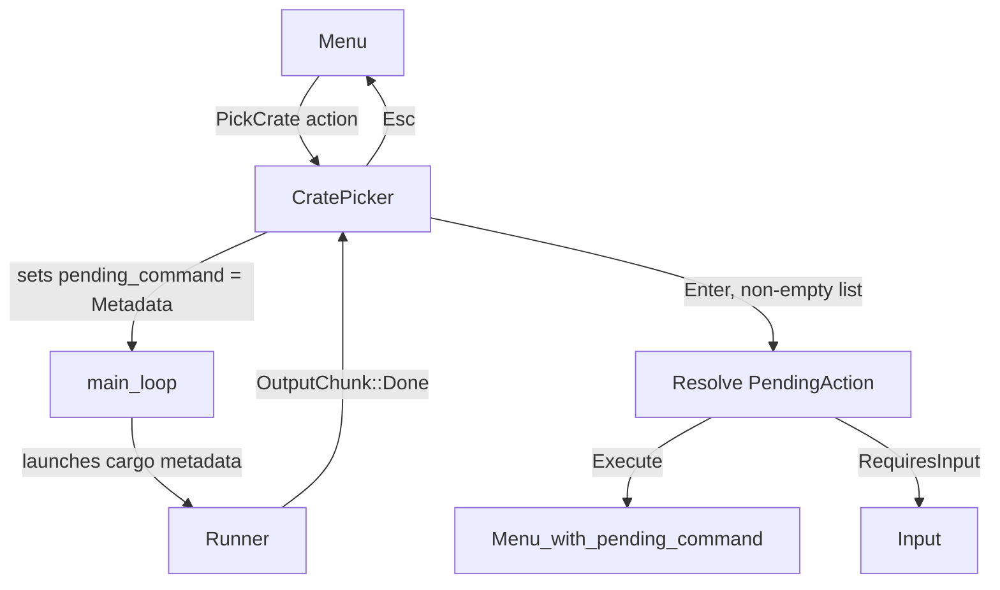

# Design Document: crate-picker

## Overview

The crate-picker feature replaces plain text input prompts for commands that operate on existing workspace dependencies (`cargo remove`, `cargo update <crate>`) with an interactive picker overlay. When the user selects one of these commands from the menu, the app transitions to `AppMode::CratePicker`, loads the workspace package list via `cargo metadata`, and presents a filterable, scrollable list. The user types to narrow the list, navigates with arrow keys, and confirms with Enter — at which point the selected crate name is substituted into the pending command and execution proceeds normally.

The design closely mirrors the existing `DepBrowser` component: same metadata loading mechanism, same `PackageInfo` data, same event-driven state machine. The key differences are that CratePicker is an overlay (not a full-screen replacement), carries a `pending_action` to resolve on selection, and exposes a filter input field.

## Architecture



The flow through `main.rs` mirrors the existing DepBrowser path: when `app.pending_command` is `Some(CargoCommand::Metadata)` and the mode is `CratePicker`, the loop calls a new `launch_metadata_for_crate_picker` method (analogous to `launch_metadata_for_dep_browser`) that spawns the metadata process without changing the mode.

## Components and Interfaces

### `CratePickerStatus` (in `src/app.rs`)

```rust
pub enum CratePickerStatus {
    Loading,
    Loaded,
    Error(String),
}
```

Mirrors `DepBrowserStatus` exactly.

### `CratePickerState` (in `src/app.rs`)

```rust
pub struct CratePickerState {
    pub packages: Vec<PackageInfo>,   // full sorted list from metadata
    pub filter: String,               // current filter text
    pub selected: usize,              // index into filtered_packages()
    pub status: CratePickerStatus,
    pub pending_action: Box<CommandAction>, // action to resolve on selection
}
```

Key method:

```rust
impl CratePickerState {
    /// Returns the subset of packages whose names contain `filter`
    /// as a case-insensitive substring. When filter is empty, returns all.
    pub fn filtered_packages(&self) -> Vec<&PackageInfo> { ... }

    pub fn move_down(&mut self) { /* wrapping, operates on filtered_packages().len() */ }
    pub fn move_up(&mut self)   { /* wrapping, operates on filtered_packages().len() */ }

    /// Clamp selected to filtered list length after filter change.
    pub fn update_filter(&mut self, new_filter: String) {
        self.filter = new_filter;
        self.selected = 0;
    }
}
```

`filtered_packages` is a pure computed view — it does not store a separate `Vec`; it filters `self.packages` on every call. This keeps state minimal and avoids synchronisation bugs.

### `AppMode::CratePicker` (in `src/app.rs`)

```rust
pub enum AppMode {
    // ... existing variants ...
    CratePicker(CratePickerState),
}
```

### `CommandAction::PickCrate` (in `src/cargo/mod.rs`)

```rust
pub enum CommandAction {
    // ... existing variants ...
    PickCrate(Box<CommandAction>),
}
```

The inner `Box<CommandAction>` is the `pending_action` — the action to execute once a crate name has been selected. It follows the same chaining pattern as `RequiresInput`.

`clone_action` in `app.rs` must be extended to handle `PickCrate`:

```rust
CommandAction::PickCrate(inner) => CommandAction::PickCrate(Box::new(clone_action(inner))),
```

### `launch_metadata_for_crate_picker` (in `src/app.rs`)

```rust
pub async fn launch_metadata_for_crate_picker(
    &mut self,
    workspace_root: &std::path::Path,
    output_tx: tokio::sync::mpsc::Sender<OutputChunk>,
) -> std::io::Result<()>
```

Identical to `launch_metadata_for_dep_browser` — spawns `CargoCommand::Metadata` without changing `self.mode`.

### `render_crate_picker` (in `src/ui/crate_picker.rs`)

```rust
pub fn render_crate_picker(state: &CratePickerState, frame: &mut Frame, area: Rect)
```

Renders into the provided `area` (which will be a centered overlay rect computed by the caller in `src/ui/mod.rs`). Layout:

```
┌─ Crate Picker ──────────────────────────────┐
│ Filter: serd|                                │
├──────────────────────────────────────────────┤
│   serde v1.0.219                             │
│ ► serde_json v1.0.140   (highlighted)        │
│   serde_derive v1.0.219                      │
├──────────────────────────────────────────────┤
│ Enter: Select   Esc: Cancel                  │
└──────────────────────────────────────────────┘
```

The overlay is rendered with `frame.render_widget(Clear, area)` first (same as `Confirm` in `src/ui/mod.rs`), then the content on top.

### COMMAND_TREE changes (in `src/cargo/mod.rs`)

`remove <crate>` and `update <crate>` entries change from:

```rust
CommandAction::RequiresInput(InputSpec { ... }, Box::new(CommandAction::Execute(...)))
```

to:

```rust
CommandAction::PickCrate(Box::new(CommandAction::Execute(...)))
```

## Data Models

### State lifecycle

```
CratePickerState {
    packages: [],
    filter: "",
    selected: 0,
    status: Loading,
    pending_action: <the wrapped CommandAction>,
}
```

On `OutputChunk::Done(success)`:
- success → parse metadata → `packages = sorted(tree.packages)`, `status = Loaded`
- failure → `status = Error(msg)`

On key events (only when `status == Loaded`):
- printable char → `update_filter(filter + char)`
- Backspace → `update_filter(filter[..last_char_boundary])`
- Down / `j` → `move_down()`
- Up / `k` → `move_up()`
- Enter → resolve `pending_action` with `filtered_packages()[selected].name`
- Esc → `AppMode::Menu`

### `filtered_packages` computation

```rust
pub fn filtered_packages(&self) -> Vec<&PackageInfo> {
    if self.filter.is_empty() {
        self.packages.iter().collect()
    } else {
        let lower = self.filter.to_lowercase();
        self.packages
            .iter()
            .filter(|p| p.name.to_lowercase().contains(&lower))
            .collect()
    }
}
```

### Resolving the pending action

When Enter is pressed and `filtered_packages()` is non-empty:

```rust
let name = filtered_packages()[self.selected].name.clone();
let resolved = apply_input_to_action(*state.pending_action, name);
match resolved {
    CommandAction::Execute(cmd) => {
        self.pending_command = Some(cmd);
        self.mode = AppMode::Menu;
    }
    CommandAction::RequiresInput(spec, next) => {
        // transition to Input mode (same as existing Input handling)
        self.mode = AppMode::Input(InputContext { spec: ui_spec, pending_action: next });
    }
    _ => { self.mode = AppMode::Menu; }
}
```

This reuses the existing `apply_input_to_action` function unchanged.

### `main.rs` pending_command loop extension

```rust
if let Some(cmd) = app.pending_command.take() {
    if let Some(workspace) = &app.workspace {
        let root = workspace.root.clone();
        let (output_tx, output_rx) = tokio::sync::mpsc::channel(256);
        event_handler = EventHandler::new(Some(output_rx));
        if matches!(app.mode, AppMode::DepBrowser(_)) {
            let _ = app.launch_metadata_for_dep_browser(&root, output_tx).await;
        } else if matches!(app.mode, AppMode::CratePicker(_)) {
            let _ = app.launch_metadata_for_crate_picker(&root, output_tx).await;
        } else {
            app.output.start_command(format!("{:?}", cmd));
            let _ = app.launch_command(cmd, &root, output_tx).await;
        }
    }
}
```

## Correctness Properties

*A property is a characteristic or behavior that should hold true across all valid executions of a system — essentially, a formal statement about what the system should do. Properties serve as the bridge between human-readable specifications and machine-verifiable correctness guarantees.*

### Property 1: Package list is sorted alphabetically

*For any* list of `PackageInfo` values loaded into `CratePickerState`, the `packages` field should be sorted in ascending alphabetical order by `name` after construction.

**Validates: Requirements 2.3**

### Property 2: Filtered list is a case-insensitive substring match

*For any* `CratePickerState` with any non-empty `packages` list and any `filter` string, every element returned by `filtered_packages()` must have a `name` that contains `filter` as a case-insensitive substring, and no package whose name contains `filter` (case-insensitively) should be absent from the result.

**Validates: Requirements 3.2, 3.3**

### Property 3: Filter change resets selected index to zero

*For any* `CratePickerState` with any selected index and any new filter string, calling `update_filter` should set `selected` to `0`.

**Validates: Requirements 3.4**

### Property 4: Backspace removes the last character from the filter

*For any* non-empty filter string, after processing a Backspace key event the filter should equal the original string with its last Unicode scalar removed.

**Validates: Requirements 3.5**

### Property 5: Navigation wraps correctly within the filtered list

*For any* `CratePickerState` with a non-empty filtered list of length `n` and any starting `selected` index `i`:
- After `move_down()`, `selected == (i + 1) % n`
- After `move_up()`, `selected == (i + n - 1) % n`
- When the filtered list is empty, neither `move_down()` nor `move_up()` changes `selected`

**Validates: Requirements 4.1, 4.2, 4.3, 4.4, 4.5**

### Property 6: Enter resolves the pending action with the selected package name

*For any* `CratePickerState` with a non-empty filtered list and a `pending_action` of `CommandAction::Execute(CargoCommand::Remove { krate: "" })`, pressing Enter should produce a `CargoCommand::Remove` whose `krate` field equals the name of the package at `filtered_packages()[selected]`.

**Validates: Requirements 5.1, 5.2**

## Error Handling

| Scenario | Behaviour |
|---|---|
| `cargo metadata` process fails (non-zero exit) | `status = Error(stderr_content)` — overlay stays open showing the error message |
| `cargo metadata` output is not valid JSON | `status = Error("Failed to parse metadata JSON: …")` |
| Empty package list after successful load | `status = Loaded`, `packages = []` — overlay shows "No packages found" |
| Enter pressed with empty filtered list | No-op; overlay remains open |
| Runner already active when CratePicker activates | `launch_metadata_for_crate_picker` returns early (same guard as existing methods) |

## Testing Strategy

### Unit tests

- `CratePickerState::filtered_packages` with empty filter returns all packages
- `CratePickerState::filtered_packages` with a filter returns only matching packages
- `CratePickerState::update_filter` resets `selected` to 0
- `CratePickerState::move_down` / `move_up` wrap at boundaries
- `CratePickerState::move_down` / `move_up` are no-ops on empty filtered list
- `handle_event` for `AppMode::CratePicker`: Esc → Menu, no pending_command
- `handle_event` for `AppMode::CratePicker`: Enter on non-empty list → resolves action
- `handle_event` for `AppMode::CratePicker`: Enter on empty list → no-op
- `COMMAND_TREE` `remove <crate>` node uses `CommandAction::PickCrate`
- `COMMAND_TREE` `update <crate>` node uses `CommandAction::PickCrate`

### Property-based tests

Use the `proptest` crate (already a dependency). Each test runs a minimum of 100 iterations.

**Property 1 — Package list sorted**
Tag: `Feature: crate-picker, Property 1: Package list is sorted alphabetically`
Generate a random `Vec<PackageInfo>` with arbitrary names, construct `CratePickerState`, assert `windows(2).all(|w| w[0].name <= w[1].name)`.

**Property 2 — Filtered list correctness**
Tag: `Feature: crate-picker, Property 2: Filtered list is a case-insensitive substring match`
Generate a random package list and a random filter string. Assert that `filtered_packages()` contains exactly those packages whose lowercased name contains the lowercased filter.

**Property 3 — Filter resets selection**
Tag: `Feature: crate-picker, Property 3: Filter change resets selected index to zero`
Generate a random state with arbitrary `selected` and call `update_filter` with any string. Assert `selected == 0`.

**Property 4 — Backspace removes last char**
Tag: `Feature: crate-picker, Property 4: Backspace removes the last character from the filter`
Generate a random non-empty filter string. Simulate a Backspace key event. Assert the resulting filter equals the original with the last `char` removed.

**Property 5 — Navigation wraps**
Tag: `Feature: crate-picker, Property 5: Navigation wraps correctly within the filtered list`
Generate a random non-empty package list (with empty filter so all are visible) and a random starting index. Assert `move_down` and `move_up` produce the expected modular result. Also test with empty list to assert no-op.

**Property 6 — Enter resolves action**
Tag: `Feature: crate-picker, Property 6: Enter resolves the pending action with the selected package name`
Generate a random non-empty package list, a random valid `selected` index, and a `pending_action = Execute(Remove { krate: "" })`. Simulate Enter. Assert the resulting `CargoCommand::Remove { krate }` equals `filtered_packages()[selected].name`.
