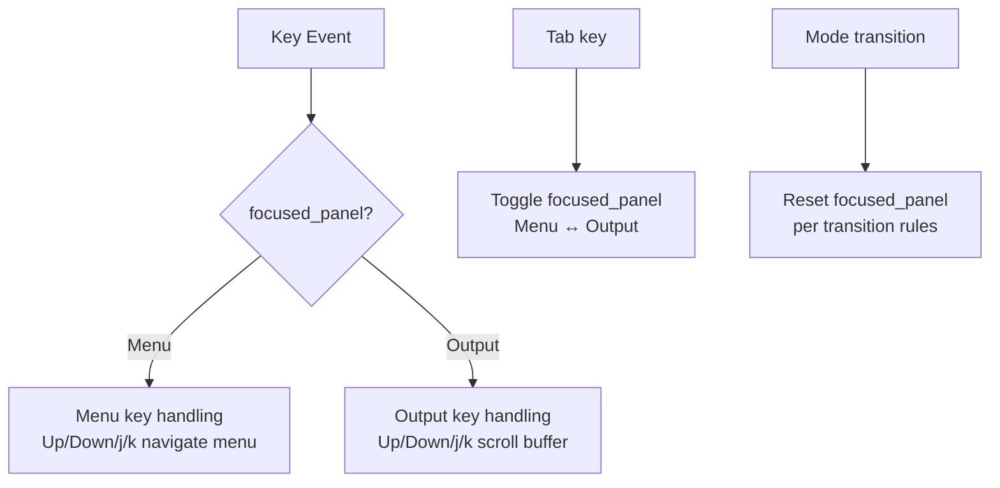

# Design Document: output-scroll

## Overview

This feature adds keyboard-driven focus management to the TUI application so that the output panel on the right can be independently focused and scrolled. Currently, scrolling only works while `AppMode::Running` is active. After this change, the user can press Tab at any time to shift focus to the output panel and scroll through past command output using arrow keys or `j`/`k`. Pressing Tab again or Esc returns focus to the menu.

The implementation is minimal: a new `FocusedPanel` enum is added to `App`, key routing in `handle_event` is gated on the focused panel, and the render functions for the menu and output panels accept a `focused: bool` parameter to draw a highlighted border.

## Architecture

The change touches three layers:

1. **State** (`src/app.rs`) — a `FocusedPanel` enum and a `focused_panel` field on `App`.
2. **Event routing** (`src/app.rs` `handle_event`) — Tab toggles focus; scroll keys are only forwarded to `OutputBuffer` when `focused_panel == Output`; modal mode transitions reset focus.
3. **Rendering** (`src/ui/output.rs`, `src/ui/menu.rs`, `src/ui/mod.rs`) — render functions receive the focused panel and draw the active panel's border in a highlight color.



## Components and Interfaces

### `FocusedPanel` enum (new, `src/app.rs`)

```rust
#[derive(Debug, Clone, Copy, PartialEq, Eq)]
pub enum FocusedPanel {
    Menu,
    Output,
}
```

### `App` struct changes

Add one field:

```rust
pub focused_panel: FocusedPanel,
```

Initialized to `FocusedPanel::Menu` in `App::new`.

### `handle_event` changes

- **Tab** in `AppMode::Menu` or `AppMode::Running`: toggle `focused_panel`.
- **Esc** when `focused_panel == Output` and mode is `Menu`: set `focused_panel = Menu` before the normal Esc handling.
- **Up / Down / j / k** in `AppMode::Menu`: only route to menu navigation when `focused_panel == Menu`; route to `output.scroll_up/scroll_down` when `focused_panel == Output`.
- **Up / Down / j / k** in `AppMode::Running`: only route to `output.scroll_up/scroll_down` when `focused_panel == Output` (existing behavior is preserved since Running already scrolls; we now also allow Tab to switch focus back to menu during running).
- **Modal transitions** (`Input`, `Help`, `Confirm`, `CratePicker`): set `focused_panel = Menu`.
- **`AppMode::Running` entry**: set `focused_panel = Output`.
- **`OutputChunk::Done`** (return to Menu): set `focused_panel = Menu`.

### Render function signatures

```rust
// src/ui/output.rs
pub fn render_output(buffer: &OutputBuffer, frame: &mut Frame, area: Rect, focused: bool)

// src/ui/menu.rs
pub fn render_menu(menu: &MenuState, frame: &mut Frame, area: Rect, focused: bool)
```

The `focused` flag controls border color: `Color::Yellow` when focused, default when not.

### `src/ui/mod.rs` call-site changes

Pass `app.focused_panel == FocusedPanel::Output` to `render_output` and `app.focused_panel == FocusedPanel::Menu` to `render_menu`.

## Data Models

No new persistent data. The only state addition is:

| Field | Type | Location | Initial value |
|---|---|---|---|
| `focused_panel` | `FocusedPanel` | `App` | `FocusedPanel::Menu` |

`OutputBuffer` already has `scroll_offset` and `auto_scroll`; no changes needed to its data model.

## Correctness Properties

*A property is a characteristic or behavior that should hold true across all valid executions of a system — essentially, a formal statement about what the system should do. Properties serve as the bridge between human-readable specifications and machine-verifiable correctness guarantees.*

### Property 1: Tab toggles focus (round trip)

*For any* `App` in `AppMode::Menu` with `focused_panel == Menu`, pressing Tab twice should return `focused_panel` to `Menu`.

**Validates: Requirements 1.1, 1.2**

### Property 2: Esc from Output focus returns to Menu focus

*For any* `App` in `AppMode::Menu` with `focused_panel == Output`, pressing Esc should set `focused_panel` to `Menu`.

**Validates: Requirements 1.4**

### Property 3: Scroll keys are blocked when Menu is focused

*For any* `App` in `AppMode::Menu` with `focused_panel == Menu` and any initial `scroll_offset`, pressing Up, Down, `j`, or `k` should leave `output.scroll_offset` and `output.auto_scroll` unchanged.

**Validates: Requirements 2.4**

### Property 4: Scroll down increases offset when Output is focused

*For any* `App` with `focused_panel == Output` and any number of output lines, pressing Down or `j` should increase `output.scroll_offset` by 1 (clamped to the maximum scrollable position).

**Validates: Requirements 2.1**

### Property 5: Scroll up decreases offset and disables auto_scroll when Output is focused

*For any* `App` with `focused_panel == Output` and `scroll_offset > 0`, pressing Up or `k` should decrease `output.scroll_offset` by 1 and set `auto_scroll` to `false`.

**Validates: Requirements 2.2, 2.3**

### Property 6: Focused panel has highlighted border

*For any* render call, the panel whose `focused` argument is `true` should produce a border block with `Color::Yellow`, and the panel whose `focused` argument is `false` should produce a border block with the default color.

**Validates: Requirements 3.1, 3.2, 3.3, 3.4**

### Property 7: Modal transitions reset focus to Menu

*For any* `App` with `focused_panel == Output`, transitioning to `AppMode::Input`, `AppMode::Help`, `AppMode::Confirm`, or `AppMode::CratePicker` should set `focused_panel` to `Menu`.

**Validates: Requirements 4.1**

### Property 8: Auto-scroll off — new lines do not change scroll offset

*For any* `OutputBuffer` with `auto_scroll == false` and any `scroll_offset`, pushing a new line should leave `scroll_offset` unchanged.

**Validates: Requirements 5.2**

### Property 9: Auto-scroll on — new lines keep latest line visible

*For any* `OutputBuffer` with `auto_scroll == true`, pushing any number of lines should keep `scroll_offset` set to `usize::MAX` (render clamps to bottom).

**Validates: Requirements 5.3**

## Error Handling

- **Tab during modal overlays** (`Input`, `Help`, `Confirm`, `CratePicker`): Tab is not handled in those modes, so focus cannot be changed while a modal is active. No error needed.
- **Scroll past bounds**: `scroll_up` uses `saturating_sub` (already implemented); `scroll_down` uses `saturating_add` and the render function clamps to `max_offset`. No panic possible.
- **Empty output buffer**: `render_output` already handles an empty history gracefully; the focused border is rendered regardless of buffer content.

## Testing Strategy

### Unit tests

Focus on specific examples and transition rules:

- `test_app_initializes_with_menu_focus` — verifies Requirement 1.3.
- `test_running_mode_sets_output_focus` — verifies Requirement 4.2.
- `test_done_event_resets_focus_to_menu` — verifies Requirement 4.3.
- `test_tab_in_menu_mode_switches_to_output` — verifies Requirement 1.1.
- `test_tab_in_running_mode_switches_focus` — verifies Requirement 5.1 routing.

### Property-based tests

Use the [`proptest`](https://github.com/proptest-rs/proptest) crate (already a dependency). Each test runs a minimum of 100 iterations.

Tag format: `// Feature: output-scroll, Property N: <property text>`

| Property | Test name | Iterations |
|---|---|---|
| 1 | `prop_tab_toggles_focus_round_trip` | 100 |
| 2 | `prop_esc_from_output_focus_returns_menu` | 100 |
| 3 | `prop_scroll_keys_blocked_when_menu_focused` | 100 |
| 4 | `prop_scroll_down_increases_offset_when_output_focused` | 100 |
| 5 | `prop_scroll_up_decreases_offset_disables_autoscroll` | 100 |
| 6 | `prop_focused_panel_has_highlighted_border` | 100 |
| 7 | `prop_modal_transitions_reset_focus_to_menu` | 100 |
| 8 | `prop_autoscroll_off_new_lines_preserve_offset` | 100 |
| 9 | `prop_autoscroll_on_new_lines_keep_bottom` | 100 |

Each property-based test must be annotated with a comment referencing the design property number and text, e.g.:

```rust
// Feature: output-scroll, Property 1: Tab toggles focus (round trip)
#[test]
fn prop_tab_toggles_focus_round_trip(...) { ... }
```
